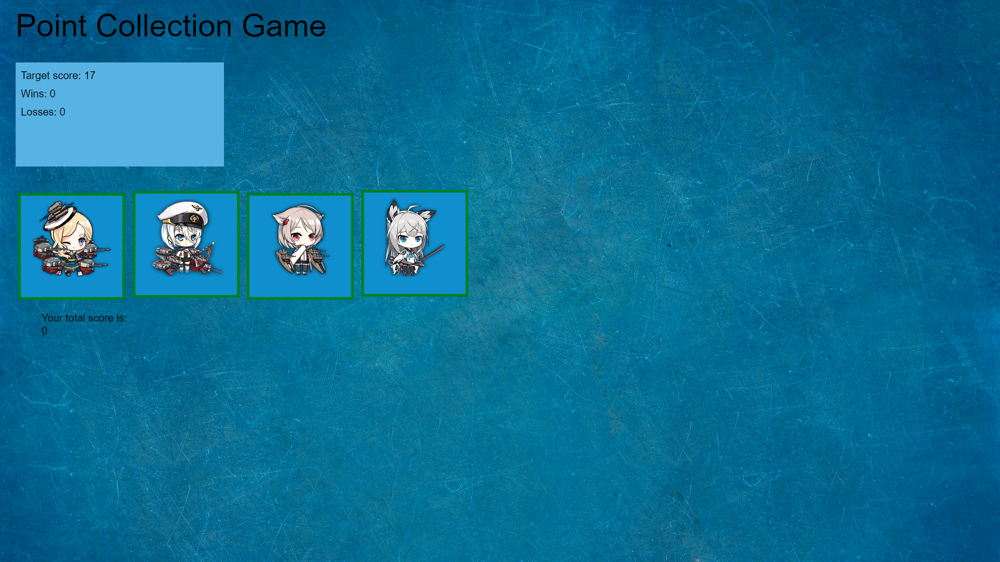

# unit-4-game

This is a game where the player clicks on four different boxes. Each box has a different value, the goal is to reach the target value without going over. Three of the buttons make the user score go up, while the far right one makes the user score go down. 

Work is still being done on the game, including stylistic work and fixing some code. 

## Technologies Used

* HTML
* CSS
* Javascript
* jQuery

## Authors

* Alfred Chan
